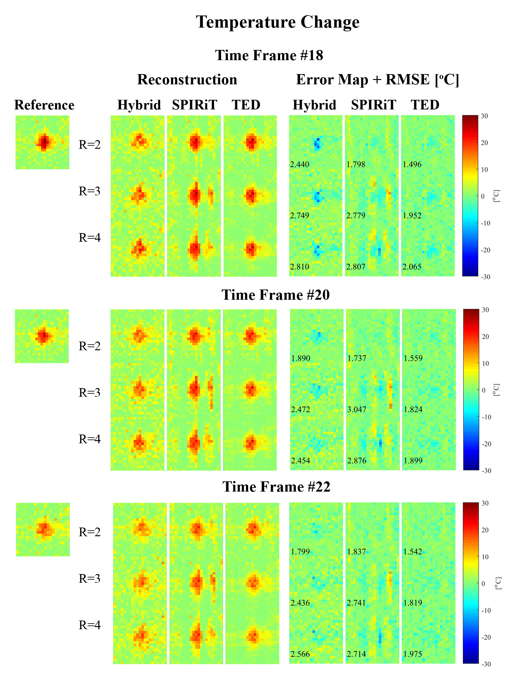

----------------------------------------------------------------------------------------
# A Matlab Toolbox for the Temporal Differences (TED) Compressed Sensing Method

Demonstration for Temperature Monitoring in MR-guided-HIFU scans
-----------------------------------------------------------------------------------------
Temporal Differences (TED) [1] Compressed Sensing is a dynamic MRI method that enables reconstruction from sub-sampled k-space data.

TED assumes that k-space data is fully acquired in the baseline time frame (t=0), and reconstructs k-space data in later time frames. Here, TED is implemented for temperature estimation from MR-guided-HIFU acquisitions [1].

TED is more general and can be applied to other dynamic MRI applications (such as cardiac MRI).

If you find a cool implementation - let us know!

 ============================================

This Matlab toolbox contains two demos for temperature change reconstruction from MR-guided-HIFU data:
1. Gel phantom data, acquiredw with a GE scanner.
2. Agar phantom data, acquired with a Philips scanner.

In both cases, fully sampled data was acquired in-vitro and then retrospectively subsampled offline, so a reference temperature map is computed from the fully-sampled dataset.

TED was compared with two well-established methods: *l*1-SPIRiT [2] and the K-space Hybrid Method [3].

## Getting Started
Clone or download the CORE-PI code.

## Running the examples
Open the demo_start.m function in Matlab, choose one example from the following list, set the desired
reduction factor (R), and run the code.

## Gel phantom demo - GE scanner

## Agar phantom demo - Philips scanner

### Acknowledgments

The TED toolbox was built upon the *l*1-SPIRiT toolbox that was created by Michael Lustig and is available at his website:
http://people.eecs.berkeley.edu/~mlustig/Software.html

The agar phantom data and the code for the K-space Hybrid Method are courtesy of Prof. William Grissom, Vanderbilt University, TA, USA.

The gel phantom data is courtesy of INSIGHTEC Ltd.

### Prerequisites
A liscence for Matlab is required. The code was tested with Matlab2017R.

### References
[1] Shimron E., Grissom W., Azhari H. (2020) "Temporal Differences (TED) Compressed Sensing: A Method for Fast MRgHIFU Temperature Imaging". *NMR in Biomedicine, in press*.

[2] Murphy M, et al. (2012) "Fast *l*₁-SPIRiT Compressed Sensing Parallel Imaging MRI: Scalable Parallel Implementation and Clinically Feasible Runtime". *IEEE TMI*.

[3] Gaur P, Grissom WA. (2015) Accelerated MRI thermometry by Direct Estimation of Temperature from Undersampled K-space Data. *MRM*.
